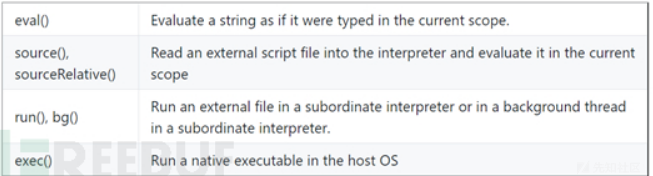

# 泛微OA-beanshell-rce

## 0X01 beanshell

[beanshell](https://github.com/beanshell/beanshell)

就是一个微型的java解释器，可嵌入到其他程序中，用于动态的执行java代码.

实例化后可以有多种方式动态执行字符串

## 0X02 RCE

访问的组件路径为/weaver/bsh.servlet.BshServlet/,大致原理即直接将用户输入的script指令直接传入了evalScript(),而在evalScript()方法中直接调用了eval()来执行传入的字符串.

## 参考

https://xz.aliyun.com/t/6560